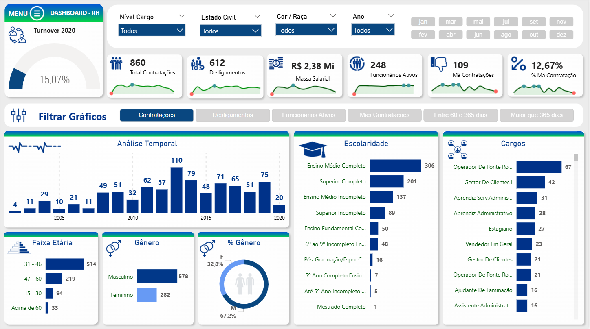

# Projeto de People Analytics | RH Controle

Este projeto teve como objetivo analisar os dados estratégicos de Recursos Humanos para otimizar a gestão de pessoas, identificar gargalos de retenção de talentos e apoiar a tomada de decisões corporativas com base em dados (Data-Driven).

Através do dashboard, é possível monitorar indicadores críticos como taxa de turnover, evolução de contratações e demissões, custos com absenteísmo e a distribuição detalhada da massa salarial de forma totalmente integrada.

### 📊 Visão Geral do Dashboard

> *Clique na imagem acima para acessar e interagir com o relatório completo no Power BI.*

---

### 🔍 Estrutura do Relatório e Funcionalidades

O dashboard foi desenvolvido pensando na experiência do usuário (UX) e no *storytelling* dos dados, dividindo-se em visões estratégicas:

* **Visão Geral (Home/Geral):** Centraliza os principais KPIs da empresa — total de funcionários ativos (248), massa salarial (R$ 2,38 Mi), contratações, desligamentos e a taxa geral de turnover (15,07%). Conta com filtros dinâmicos por cargo, ano, escolaridade e dados demográficos.
* **Contratações x Demissões:** Análise temporal histórica do fluxo de entradas e saídas de colaboradores de 2005 a 2020, permitindo identificar o crescimento acumulado e picos sazonais de rotatividade.
* **Massa Salarial:** Visão estritamente financeira do RH, mapeando a distribuição da folha de pagamento ativa por cargo, gênero, faixa etária, escolaridade e cor/raça, além de destacar o teto e o piso salarial vigentes.
* **Tipo de Afastamento:** Segmentação detalhada dos desligamentos em Turnovers Ativos, Passivos e Espontâneos, ajudando a liderança a entender os reais motivos da perda de profissionais.
* **Retenção:** Painel focado em avaliar a qualidade do processo seletivo, medindo o tempo de permanência na empresa (menor de 60 dias, entre 60 e 365 dias, e maior de um ano) para identificar e mitigar as chamadas "Más Contratações".
* **Ausências (Absenteísmo):** Análise do impacto financeiro causado por faltas, atrasos e atestados médicos, permitindo cruzar quais setores, cargos ou faixas etárias demandam maior atenção ou políticas de bem-estar.

### 🛠️ Tecnologias Utilizadas

* **Power BI:** Criação do design do dashboard, navegação por botões e visualização dos dados.
* **Power Query:** Processo de ETL (Extração, Transformação e Limpeza dos dados de RH).
* **Linguagem DAX:** Criação de medidas complexas, cálculos de taxas de turnover dinâmicas, inteligência de tempo e acumulados financeiros.
