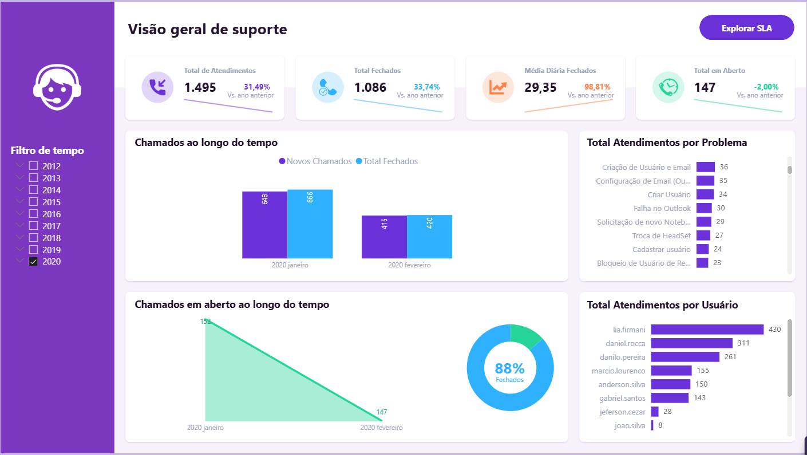

# Projeto de Analytics para TI | Gestão de Suporte e SLAs

Este projeto teve como objetivo analisar os dados de chamados de suporte (Help Desk / Service Desk) para monitorar a eficiência do atendimento, avaliar o desempenho da equipe de analistas e garantir o cumprimento das metas de SLA (Service Level Agreement).

O dashboard fornece uma visão completa do ciclo de vida dos chamados, permitindo identificar gargalos operacionais, os problemas mais recorrentes e quais cenários estão gerando estouros de prazo (SLAs extrapolados).

### 📊 Visão Geral do Dashboard

> *Clique na imagem acima para acessar e interagir com o relatório completo no Power BI.*

---

### 🔍 Estrutura do Relatório e Funcionalidades

O relatório foi estruturado de forma navegável através de botões internos para alternar entre diferentes visões e status de chamados:

* **Visão Geral de Suporte:** Painel macro que acompanha as principais métricas de volume — Total de Atendimentos (1.495), Total Fechados (1.086), Média Diária de Fechamentos (29,35) e Volume Atual em Aberto (147). Apresenta o fluxo de novos chamados versus fechados ao longo dos meses e o ranking de solicitações por usuário e tipo de problema (como Criação de Usuário/E-mail e Configuração de E-mail).
* **Navegação Avançada de SLAs:** Uma visão detalhada segmentada por abas interativas para avaliar a qualidade e o tempo de resposta:
    * **Em Aberto:** Foco nos 147 chamados pendentes, distribuídos pelo tempo restante de SLA (prazos de 6h, 8h, etc.) e status atual (Aguardando feedback, Enviado para 3º nível, etc.).
    * **Total Atendido:** Consolidação de todo o histórico de chamados encerrados no período selecionado.
    * **SLA Atendido:** Métricas específicas dos chamados que foram resolvidos **dentro do prazo acordado** (alcançando uma taxa geral de 77% de conformidade).
    * **SLA Extrapolado:** Painel crítico para melhoria contínua, isolando os 349 chamados que estouraram o prazo. Permite identificar com precisão quais analistas concentram essas ocorrências e quais problemas (ex: solicitações categorizadas como "Outros" ou "Dúvidas") são mais propensos a atrasos.

---

### 🛠️ Estrutura de Dados e Tecnologias

O projeto foi construído seguindo as melhores práticas de modelagem multidimensional (**Star Schema**) diretamente no Power BI:

* **Modelagem de Dados (Tabelas d/f):** * Fatos: `fOcorrencias` (registro principal dos chamados) e `fTempoStatus` (histórico de transição de status).
    * Dimensões: `dCalendario`, `dProblema`, `dSLA`, `dStatus` e `dUsuarios`.
* **Power Query:** Utilizado para o processo de ETL, garantindo a tipagem correta de datas, tratamento de textos e relacionamento limpo entre as tabelas.
* **Linguagem DAX:** Criação de medidas organizadas em tabelas exclusivas (`_Medida` e `_Medidas aux`), incluindo cálculos de taxas de SLA %, acumulados e comparações com o período anterior (MoM / YoY).
