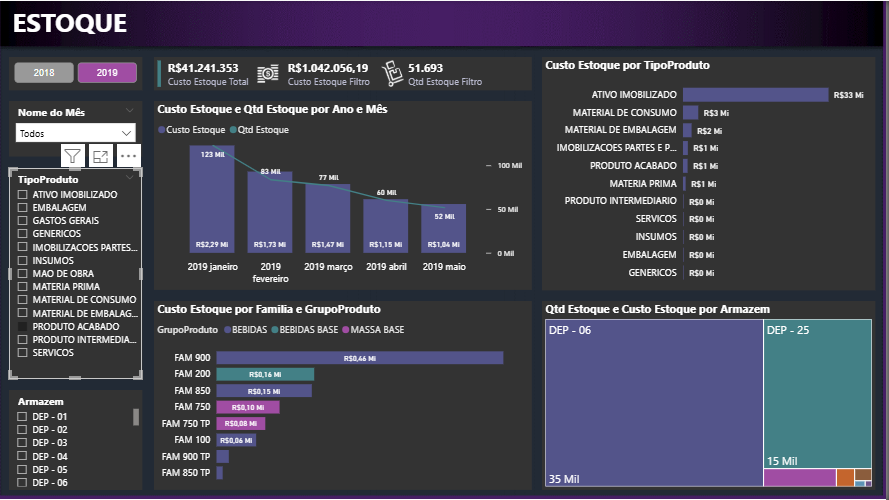

# Projeto de Analytics para Supply Chain | Controle de Estoque

Este projeto teve como objetivo analisar e gerenciar o inventário da empresa, fornecendo visibilidade clara sobre o capital de giro retido em produtos, a rotatividade de materiais e a ocupação dos armazéns. 

O dashboard foi desenvolvido para apoiar os setores de compras e logística, permitindo identificar oportunidades de redução de custos, controle de perdas e otimização do nível de estoque físico e financeiro.

### 📊 Visão Geral do Dashboard

> *Clique na imagem acima para acessar e interagir com o relatório completo no Power BI.*

---

### 🔍 Estrutura do Relatório e Indicadores Chave

O painel centraliza as principais métricas de inventário com alta capacidade de segmentação:

* **Métricas Globais (KPIs):** Apresenta o **Custo Estoque Total** acumulado (ultrapassando R$ 41 Milhões), permitindo o cruzamento dinâmico com o valor financeiro e a quantidade física filtrada por período ou categoria.
* **Análise de Tendência (Temporal):** Gráfico combinado que monitora o comportamento do custo e da quantidade de itens em estoque mês a mês (como a evolução de janeiro a maio de 2019), facilitando a identificação de sazonalidades ou tendências de escoamento.
* **Curva por Tipo de Produto:** Estruturação volumétrica que revela onde o capital está concentrado. O gráfico destaca categorias como *Ativo Imobilizado*, *Material de Consumo*, *Materia Prima* e *Produto Acabado*.
* **Segmentação por Família e Grupo:** Análise detalhada de subcategorias (ex: *Bebidas*, *Massa Base*) cruzadas com suas respectivas famílias de produtos (FAM), garantindo um nível de granularidade ideal para auditorias de estoque.
* **Ocupação por Armazém (Treemap):** Distribuição visual da quantidade e custo alocados por depósito (como o *DEP - 06* e *DEP - 25*), ideal para balanceamento de carga logística e gestão de espaço físico.

---

### 🛠️ Tecnologias e Recursos Aplicados

* **Power BI:** Desenvolvimento de layout focado em usabilidade e filtros rápidos (segmentadores por ano, mês, tipo de produto e armazém específico).
* **Power Query:** Limpeza, tratamento de dados nulos e estruturação de tabelas de inventário originadas de sistemas ERP.
* **Linguagem DAX:** Criação de medidas para cálculo de estoque atual, filtros dinâmicos contextuais e conversões de unidades financeiras para leitura rápida (K/Mi).
